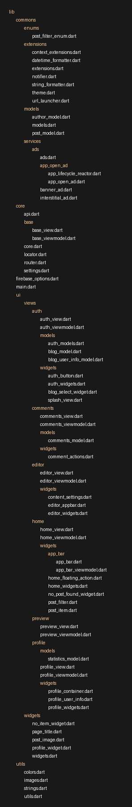

## Export Files and Folders as PNG
Export the folder and its contents at the given file path as a tree view image using Python.

### Usage
```bash
pip install Pillow
python tree.py filePath
```
or
```bash
pip install Pillow
python3 tree.py filePath
```

### Example Output

